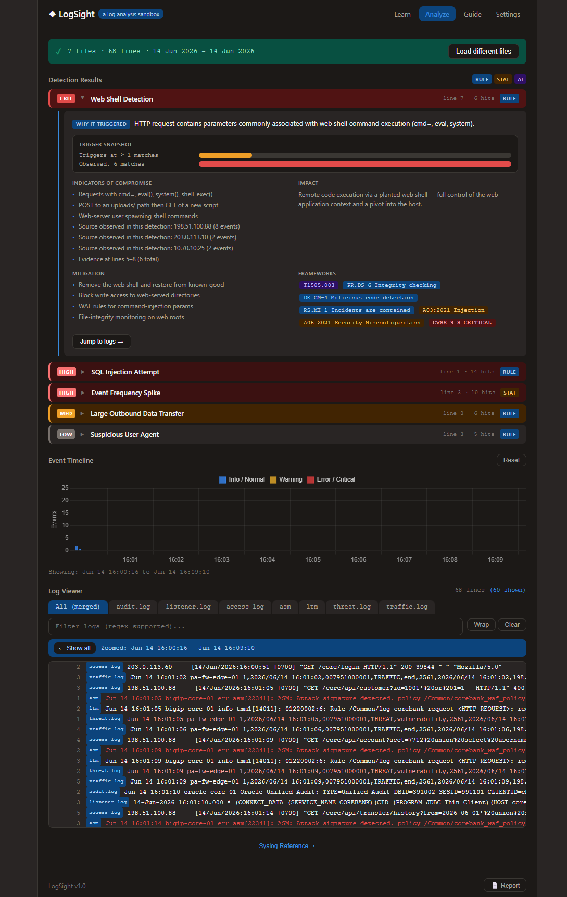

# LogSight — a log analysis sandbox

A standalone, browser-based log analysis lab for learning and practicing cybersecurity
investigation. No server, no build step, no internet required — just open `index.html`.



## What it does

LogSight has two modes:

### Learn Mode
Guided scenarios with pre-built log data for hands-on practice. Each scenario walks you
through a real attack chain:

1. **Pick a scenario** — SSH brute force, web shell upload, DNS exfiltration, and more
2. **Investigate** — read the logs, use the regex filter and interactive timeline to find anomalies
3. **Answer** — fill in the investigation questions
4. **Learn** — unlock the Intelligence Report: Indicators of Compromise, attack steps
   (kill chain), mitigations, and framework mappings (MITRE ATT&CK, NIST CSF, OWASP, CVSS)

### Analyze Mode
Load your own log files for real-world investigation:

1. **Load files** — drop files, pick a folder, or select individual `.log` files
   (accepts `.log` and extensionless text files, up to a configurable size limit)
2. **Review** — a post-load summary shows date-range coverage, line counts, and gaps
3. **Analyze** — the detection engine runs automatically and surfaces prioritized alerts
4. **Investigate** — zoom the timeline (which filters the log viewer) and drill in with regex
5. **Report** — export your findings

## Detection Engine

Three layers, the first two fully offline:

| Layer | Type | Tag | What it does |
|-------|------|-----|--------------|
| 1 | Rule-based | `RULE` | Regex signatures: SQLi, XSS, path traversal, brute force, web shells, … |
| 2 | Statistical | `STAT` | Baseline + anomaly scoring: frequency spikes, off-hours activity, event chains |
| 3 | AI | `AI` | *Optional, requires a provider key.* Natural-language queries, auto-summary, incident reports, and behavioral analysis (beaconing / sequence anomalies) |

## AI Enhancement (optional)

Layer 3 connects to Claude or OpenAI. Before any data leaves your browser it is
**pseudonymized** — IP addresses, hostnames, usernames, emails, and file paths are
replaced with consistent dummy values (real IPs → RFC 5737 ranges, etc.). The mapping
table stays local; you can preview it in Settings. A "local-only" mode sends just
summary statistics, never log content.

The API key is never persisted to disk.

## Tech

Pure HTML5 + CSS3 + vanilla JavaScript. The only bundled dependencies (all local, in `lib/`):

- **Chart.js** + **chartjs-adapter-date-fns** — the interactive timeline
- **chartjs-plugin-zoom** + **Hammer.js** — scroll/drag/pinch zoom

No framework, no bundler, no `npm install`.

## Requirements

No install step is required for normal use. LogSight is a static browser app:

- A modern browser
- Optional local static HTTP server for folder picker support
- Optional Claude/OpenAI API key only when enabling Layer 3 AI features

See `requirements.txt` for the machine-readable dependency note.

## Project structure

```
log-analysis-lab/
├── index.html
├── css/style.css
├── js/
│   ├── app.js            — orchestration / UI wiring
│   ├── scenarios.js      — Learn-mode scenario data
│   ├── frameworks.js     — MITRE / NIST / OWASP reference data
│   ├── log-parser.js     — format detection + timestamp extraction
│   ├── detection.js      — rule-based + statistical detection
│   ├── pseudonymizer.js  — consistent data pseudonymization
│   ├── timeline.js       — Chart.js timeline wrapper
│   ├── log-viewer.js     — virtual-scrolling log viewer
│   └── worker.js         — background parsing/detection (optional)
├── lib/                  — vendored libraries
└── examples/             — sample .log files
```

## Running it

Just open `index.html` in a browser. For full functionality (the folder picker and
local file reads behave best over HTTP), you can optionally serve it:

```sh
python -m http.server 8070
```

Then visit `http://localhost:8070`.

## Supported log formats

Syslog (BSD), Apache access/error logs, Palo Alto PAN-OS CSV syslog,
Common Event Format (CEF), Oracle Net listener logs, BIND DNS query logs,
JSON logs, and ISO 8601 timestamped lines. Format is auto-detected per line.

## Examples

The `examples/` folder is part of the project and should be included when publishing
the repo. It contains single-source scenarios plus `examples/corebanking-killchain/`,
which correlates Palo Alto firewall/threat logs, F5 LTM/ASM, Apache access logs,
Oracle listener logs, and Oracle audit logs.

## License

MIT License. See `LICENSE`.

## Contributors

See `CONTRIBUTORS.md`.
